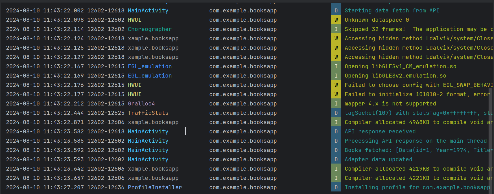
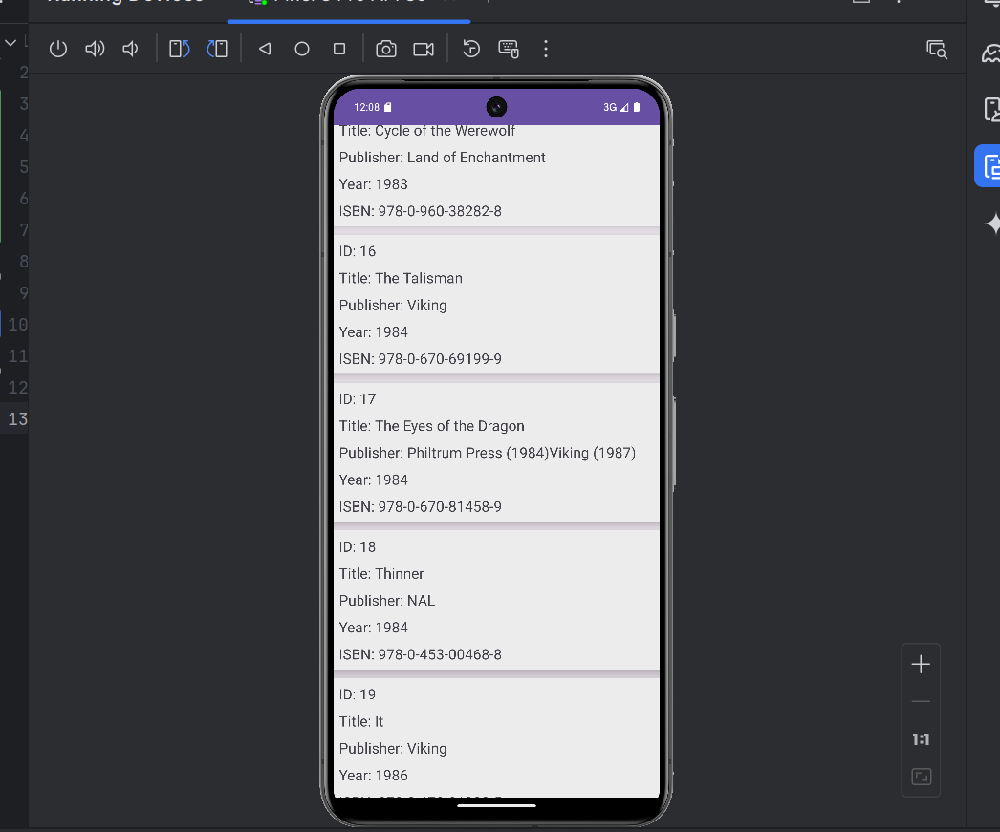

# Books APi 
## Table of contents

- [Introduction](#introduction)
- [Demo](#demo)
- [Run](#run)
- [Technology](#technology)
- [Features](#features)
- [Database Models](#database)
- [Color Palette](#colors)
- [License](#license)

## Introduction

Books App(Android Assessment) is an Android application that fetches a list of books from the Stephen King API and displays them using a RecyclerView. The app uses Room for local database storage and follows the MVVM architecture.


NOTE: Please read the RUN section before opening an issue.

## Demo





The app displays a list of books with details such as title, publisher, ISBN, and year. You can view the list of books fetched from the API and stored locally in the database.
## Run

To run this application, you need to set up the necessary environment and dependencies. Follow these steps:

1. **Clone the repository**:
   ```bash
   git clone https://github.com/yourusername/AndroidAssessment.git
2.Open the project in Android Studio.

3.Install dependencies: Open build.gradle files and ensure that all dependencies are included.

4:API Configuration:

Update the base URL in MainActivity.kt if needed:

Api:private val URL_BASE = "https://stephen-king-api.onrender.com/api/"


## Technology

The application is built with:

The application is built with:

-Kotlin
-Android SDK
-Room for local database
-Retrofit for network operations
-RecyclerView for displaying lists
-MVVM architecture
-ViewModel
-LiveData
-Coroutines
-Gson for JSON serialization

## Features

The application provides the following features:

-Fetches book data from the Stephen King API.
-Stores book data locally using Room Database.
-Displays a list of books with details including ID, title, publisher, ISBN, and year.
-Implements MVVM architecture for a clean and maintainable codebase.


## Database

Database Models
Book Entity
The Book entity represents a book in the Room database.

-bookId (Int) - Primary Key, auto-generated
-id (Int) - Book ID from the API
-title (String) - Title of the book
-publisher (String) - Publisher of the book
-isbn (String) - ISBN of the book
-year (String) - Year of publication


## Colors

Below is the color palette used in this application:

-  `#478ba2`


## License

Apache-2.0 License:
